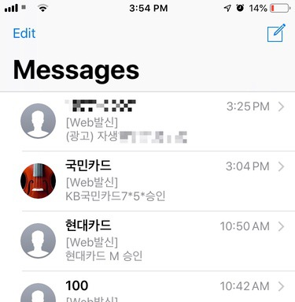
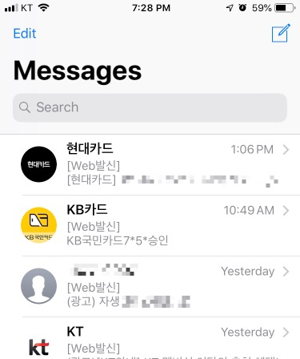

# 함께 만드는 주소록

* 어느날 문득 내 문자메시지를 보면서 왜 이렇게 문자메시지함에 직관성이 없을까? 생각이 들었는데 이게 다 기업체들의 이미지가 폰에서 제공되지 않아 생긴일이라 여겼다. 애플은 자체적으로 프로필 이미지를 제공해주면서...
* 하여 가능하면 카카오톡 플러스 친구의 프로필 사진을 문자메시지에서도 볼 수 있으면 어떨까 하는 생각을 휴가날 생각하고 실천에 옮겨 보는중... 어차피 문자도 대부분 기업체에서 보내주는 메시지이니 (잠시 눈물 좀 닦고) 주소록이 직관적이면 좋을것 같다는 생각에.. 그리고 누구라도 한번쯤은 고민을 해봤을거라 하는 생각에..
* 얼마나 하다 그만 둘지는 모르겠으나 생각이 들었으면 무라도 썰자는 심정으로 시작해본다.
* 함께 만든는 주소록을 희망하면서 프로젝트명을 잡았음. 그 전에 우선 내가 잘 쓸수 있게 만들어보자!

## 2019.04.06 19:36 업데이트

* 신용카드사 2개, 통신사 1개 등록

